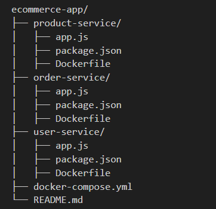

# Project Documentation

## Project Directory Structor



## Prerequisite

We need to install the following:
- docker 
- java
- minikube
- git

## Process

### Create the project Directory and cd to it

```python
mkdir e-com-project
```

```python
cd e-com-project
```

### Clone the project from GitHub 

```python
git clone https://github.com/vicky3663/ecommerce-app.git
```

### Build the Docker Images

- Navigate to each service directory and run:

```python
docker build -t product-service:1.0 .
```

```python
docker build -t order-service:1.0 .
```

```python
docker build -t user-service:1.0 .
```

### Push the images to DockerHub

- Tag the images:

```python
docker tag product-service:1.0 dhub-username/product-service:1.0 
```

```python
docker tag order-service:1.0 dhub-username/order-service:1.0
```

```python
docker tag user-service:1.0 dhub-username/user-service:1.0 
```

- Login to DockerHub:

```python
docker login -u dockerhub-user-name
``` 

- Push image to DockerHub:

```python
docker push <tagged-image>
```

### Run the Services

Start the containers:

```python
docker run -d --name prod-container -p 5001:5001 product-service:1.0
```

```python
docker run -d --name order-container -p 5002:5002 order-service:1.0
```

```python
docker run -d --name user-container -p 5003:5003 user-service:1.0
```
